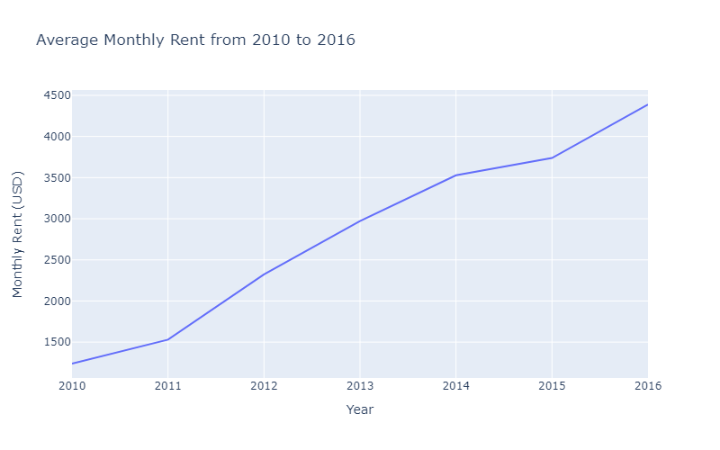
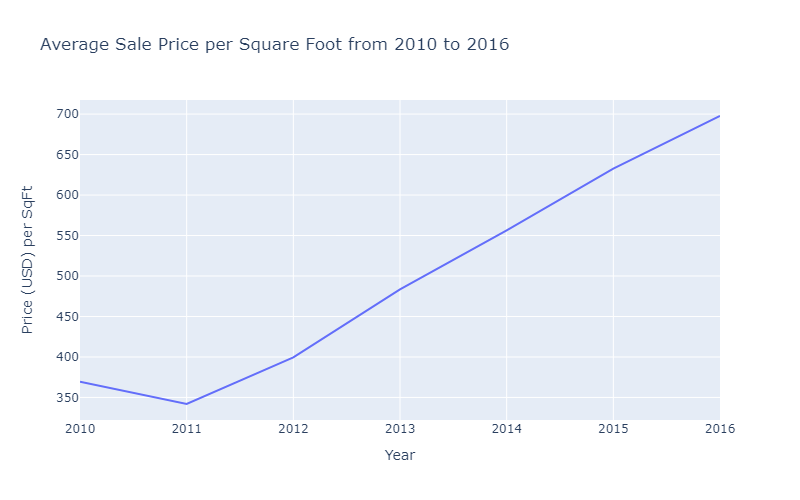
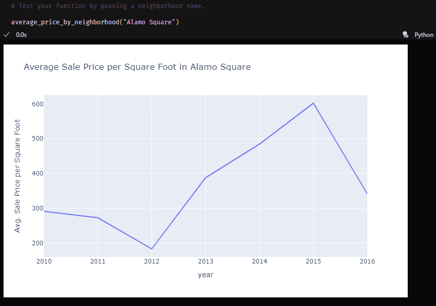
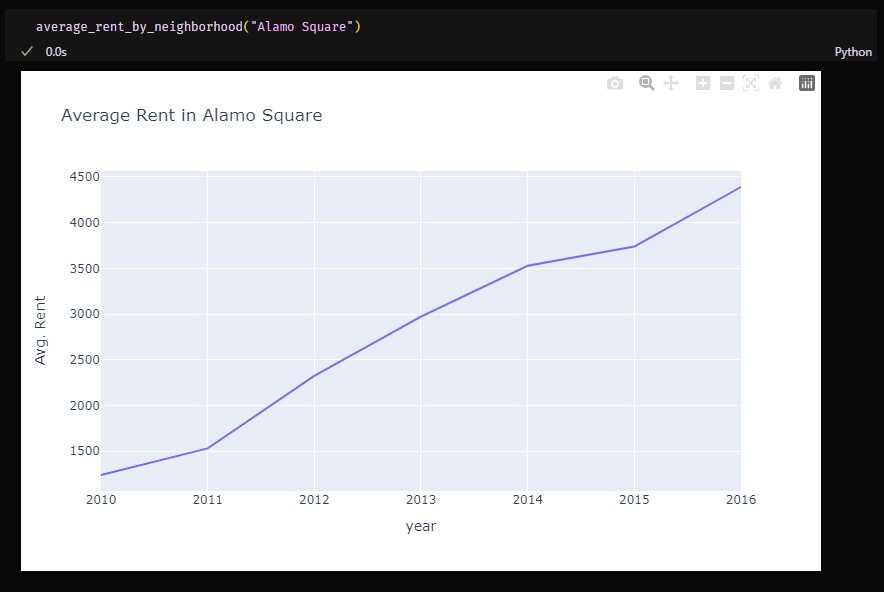
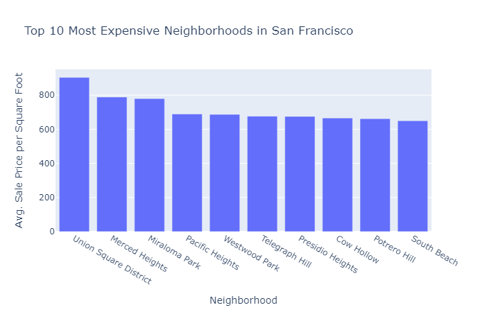
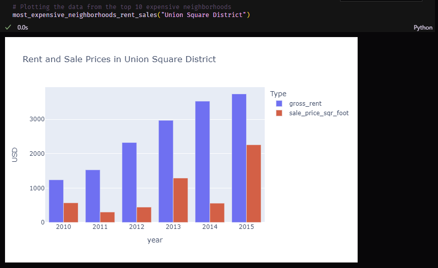
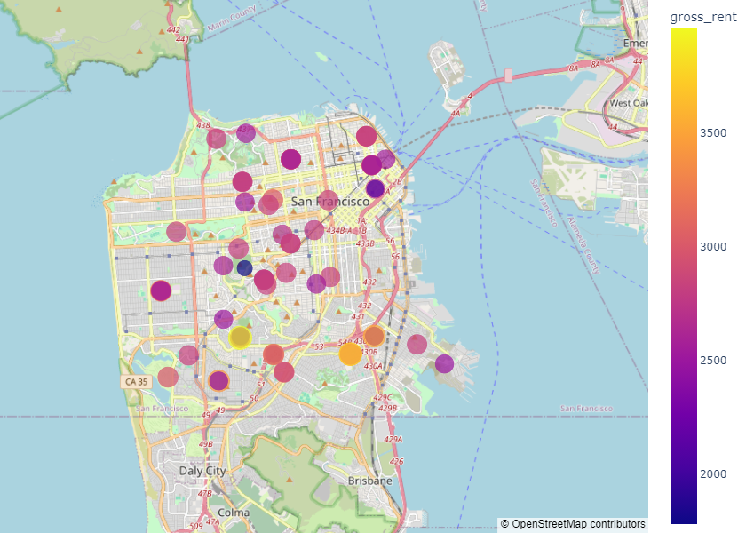

# Unit 6 - San Francisco Real Estate Dashboard


## Background

Your company has recently launched a Real Estate Investment division, and your supervisor needs your help developing a prototype dashboard for San Francisco investment opportunities. The dashboard will use charts, maps, and visualizations to help customers decide if they want to invest in rental properties.

1. You have been provided data on rental properties in San Francisco that includes census data and geographical data.
2. You will need to clean and organize the data.
3. Create charts, maps, and visualizations using Plotly.
4. Integrate the visualizations into a user-friendly dashboard with Streamlit.

The dashboard will provide customers with information to make informed investment decisions and find the best investment opportunities.

In this assignment, you will accomplish the following tasks:

1. [Complete a notebook of rental analysis](#Rental-Analysis).
2. [Create a dashboard of interactive visualizations to explore the market data](#Dashboard).

## Files

* [sfo_neighborhoods_census_data.csv](Starter_Code/Data/sfo_neighborhoods_census_data.csv)
* [neighborhoods_coordinates.csv](Starter_Code/Data/neighborhoods_coordinates.csv)
* [Rental Analysis Starter Jupyter Notebook](Starter_Code/rental_analysis.ipynb)
* [Dashboard Starter App](Starter_Code/dashboard.py)

## Instructions

### Before You Begin

1. Create a new repository for this project called `real-estate-dashboard` or some other creative name. **Do not add this homework to an existing repository**.

2. Clone the new repository to your computer.

3. Inside the folder you just created, add the files from the starter code folder. These will be the main scripts to run for each analysis.

4. Push the above changes to GitHub.

### Rental Analysis

The first step to building the dashboard is to work out all of the calculations and visualizations in an analysis notebook. Once the code is worked out here, it can be copied over to a dashboard code and used with Streamlit to create the final layout. Use the `rental_analysis.ipynb` to complete the following:

#### Housing Units Per Year

In this section, you will calculate the number of housing units per year and visualize the results as a bar chart using the Pandas plot function.

Note: By default, the limits auto-scale to the data. However, it is hard to see the difference between the yearly data. In the optional challenge, you can use the min, max, and standard deviation of the data to manually scale the y limits of the plot.

Default Bar Chart

  

Bar Chart with y-axis limits adjusted

  


#### Average Housing Costs in San Francisco Per Year

In this section, you want to determine the average sales price per year and the average gross rent per year to better understand housing costs over time. For example, a customer will want to know if they should expect an increase or decrease in the property value or rent over time so they can determine how long to hold the rental property. You will visualize the average (mean) gross rent and average price per square foot per year and visualize it as a line chart.

1. Calculate the mean `gross_rent` and `sale_price_sqr_foot` for each year.
2. Visualize the mean `gross_rent` and `sale_price_sqr_foot` for each year as two line charts.

  

  

#### Average Prices By Neighborhood

In this section, you'll create a function named average_price_by_neighborhood to analyze and visualize the housing market trends in a specific San Francisco neighborhood. First, it filters housing data for the chosen neighborhood. Then, it cleans the data, ensuring sale prices are numeric and removes any missing values. Next, it calculates the yearly average sale price per square foot. Finally, it generates a line plot displaying this trend over time. The function will use Plotly Express for visualization, emphasizing clarity with labeled axes and a descriptive title. Upon calling this function with a neighborhood's name, it will return the trend plot. The same steps will be followed to analyze average gross rent trends.

1. Begin by defining a function named average_price_by_neighborhood that takes a single parameter: neighborhood. This parameter will be used to filter the data for a specific neighborhood.
Filtering the DataFrame:

2. Use the given parameter to filter rows in the DataFrame where the neighborhood matches the provided one. Remember, the DataFrame is likely called something like sfo_data, and you'll be checking the "neighborhood" column.

3. To ensure calculations are accurate, convert the sale_price_sqr_foot column to a numeric type. This helps in case the data is not already in numeric form. Use a method that allows you to specify that errors during conversion should not cause a crash, but rather, should be ignored.
```python
# Convert 'sale_price_sqr_foot' to a numeric type, ignore errors to avoid conversion issues
    df_prices['sale_price_sqr_foot'] = pd.to_numeric(df_prices['sale_price_sqr_foot'], errors='coerce')
```

4. After conversion, some rows might have missing values (NaN) in the sale_price_sqr_foot column. You should remove these rows to ensure your averages are accurate.

5. Group the filtered and cleaned data by the year column. For each group, calculate the mean (average) sale price per square foot. This step requires using a grouping method and then applying a mean calculation on the sale_price_sqr_foot column.
Creating the Plot:

6. Use Plotly Express to create a line plot of the average sale price per square foot over the years. The x-axis should represent the years, and the y-axis should represent the average sale price per square foot. You can achieve this by using the index of the grouped data for the x-axis and the calculated means for the y-axis.
Customize the plot with appropriate labels for the x and y axes, such as "Year" for the x-axis and "Avg. Sale Price per Square Foot" for the y-axis. Also, set the title to indicate it's showing the average sale price per square foot in the specified neighborhood.

6. Finally, make sure your function returns the plot object. This allows the plot to be displayed when the function is called.

Call the funtion on a neighborhood and visualize the results.

Repeat this process, except this time calculating the average gross rent.

  

  

#### Top 10 Most Expensive Neighborhoods

In this section, you want to figure out which neighborhoods are the most
expensive. You will need to calculate the mean sale price for each neighborhood
and then sort the values to obtain the top 10 most expensive neighborhoods on
average. Plot the results as a bar chart.

***Hint***: You'll need to use the `groupby` method  and `mean` method.

  

#### Comparing cost to purchase versus rental income

In this section, you will define a function that takes a selected neighborhood as input, filters the data for that neighborhood, creates a bar chart using Plotly Express, and returns the chart as a result.

1. Begin by defining a function with the appropriate name and a parameter that allows the user to specify a neighborhood. This parameter will be used to filter the data.

2. Inside the function, create a new DataFrame by filtering the original sfo_data DataFrame. Use a condition that matches the neighborhood column with the parameter value. This will isolate the data for the selected neighborhood.

3. Use Plotly Express to create a bar chart. The function px.bar() is what you'll use here.

4. The first argument should be the filtered DataFrame you created.

5. Specify the x-axis data to be the index of the DataFrame. This typically represents the years or a time dimension in the sfo_data.

6. The y-axis should compare two columns: gross_rent and sale_price_sqr_foot. These need to be passed as a list to the y parameter.

7. Set the title of the plot to include the selected neighborhood. This makes the plot dynamically reflect the chosen area.

8. Use the labels parameter to customize the axis labels. You'll want to rename the generic "value" and "variable" to more descriptive labels, like "USD" for value and perhaps "Type" for variable, indicating whether the data is for rent or sale price per square foot.

9. Set barmode to 'group' to ensure that the bars are grouped side by side, rather than stacked or overlaid. This is crucial for comparing the two types of data.

10. Further customize the plot's layout by updating it. Specifically, you might want to set the y-axis label to "USD" and possibly adjust the legend to clarify what each bar represents.

11. Finally, ensure your function returns the plot object. This makes it possible to display the plot just by calling the function with a selected neighborhood.

Call the funtion on a neighborhood and visualize the results.

  

#### Neighborhood Map

In this section, you will read in neighborhoods location data and build an
interactive map with the average rent price per neighborhood. Use a
`scatter_mapbox` from Plotly express to create the visualization. 

  


### Dashboard

Now that you have worked out all of the code and analysis, you will use the
Streamlit library to build an interactive dashboard for all of the
visualizations. 

Use the provided starter notebook, `dashboard.ipynb`, for your dashboard code. 

Copy the code for each visualization from the analysis notebook
and place it into separate functions (1 function per visualization). This will
make it easier to build and modify the layout later. Each function should
return the plot figure in a format that Streamlit can use to plot the
visualization. For the Average Prices/Gross Rent By Neighborhood plot, add a dropdown selector
using st.selectbox to allow the user to choose a neighborhood. 

There are no hard requirements for the layout of this dashboard, so use your own imagination and creativity!


#### Custom Visualizations

Feel free to replace any of the above visualizations with a custom visualization of equal or higher analytic value.

### Submission

* Use the starter notebooks for the analysis and dashboard and upload these to Github.

* Complete your README to explain how to run and use your dashboard also includes screenshots or an animated gif of your dashboard.

* Submit the Github URL repository to Canvas.

---

### Requirements

#### Rental Analysis  (10 points)

##### To receive all points, your code must:

* Calculate the number of housing units per year. (5 points)
* Create a bar chart visualization of the rental analysis results. (5 points)


#### Average Housing Costs in San Francisco per Year (10 points)

##### To receive all points, your code must:

* Calculate the average gross rents and sales prices per year. (5 points)
* Generate line plots that show the gross rents and sales prices per year. (5 points)

#### Average Prices by Neighborhood (10 points)

##### To receive all points, your code must:

* Calculate the `sales_price_per_sqr_foot` and `gross_rent` for each year. (5 points)
* Generate line plots using plotly to show the `sales_price_per_sqr_foot` and `gross_rent` per year. (5 points)

#### Top 10 Most Expensive Neighborhoods (10 points)

##### To receive all points, your code must:

* Create a dataFrame with the mean house values by neighborhood per year. (5 points)
* Create a visualization using plotly to show the `average_house_value` mean per year, adding a neighborhood dropdown selector option. (5 points)

#### Comparing Cost to Purchase Versus Rental Income (10 points)

##### To receive all points, your code must:

* Use plotly to generate a bar chart that compares sales price and gross rents side by side. (5 points)
* Add a neighborhood dropdown selector option using plotly. (5 points)

#### Neighborhood Map (10 points)

##### To receive all points, your code must:

* Create a DataFrame joining the neighborhood location data with the rent and sales data. (5 points)
* Generate an interactive map with average prices per neighborhood. (5 points)

#### Interactive Dashboard (10 points)

##### To receive all points, your code must:

* Copy the code for each visualization from the analysis notebook and place it into separate functions. (5 points)
* Use the Streamlit library in conjunction with these functions to build an interactive dashboard for all of the visualizations. (5 points)

#### Optional Bonus - Cost Analysis (30 points)

##### To receive all bonus points, your code must:

* Create a parallel coordinates plot to show the most expensive neighborhoods in San Francisco per year. (10 points)
* Create a parallel categories plot to show the most expensive neighborhoods in San Francisco per year. (10 points)
* Create a sunburst plot to show the most expensive neighborhoods in San Francisco per year. (10 points)

#### Coding Conventions and Formatting (10 points)

##### To receive all points, your code must:

* Place imports at the beginning of the file, just after any module comments and docstrings and before module globals and constants. (3 points)
* Name functions and variables with lowercase characters and with words separated by underscores. (2 points)
* Follow Don't Repeat Yourself (DRY) principles by creating maintainable and reusable code. (3 points)
* Use concise logic and creative engineering where possible. (2 points)

#### Deployment and Submission (10 points)

##### To receive all points, you must:

* Submit a link to a GitHub repository that’s cloned to your local machine and contains your files. (5 points)
* Include appropriate commit messages in your files. (5 points)

#### Code Comments (10 points)

##### To receive all points, your code must:

* Be well commented with concise, relevant notes that other developers can understand. (10 points)

---

© 2023 Shaolin AI. All Rights Reserved.
